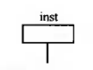
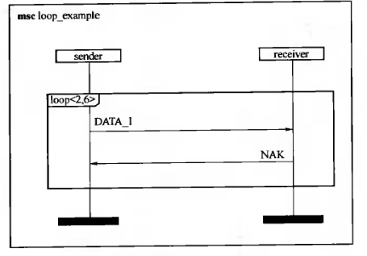

# MSC

MSC用来描述多个实体之间和实体与环境之间消息交互的顺序.

协议开发中,可以描述PDU(协议数据单元)的交换时序.

通信软件中,可以描述通信实体的消息交互情况.

更可以描述多个不对等实体之间消息交互,比如SDL中进程与功能块之间的消息交互

### MSC的特点

### MSC的实体类型

- MSC文档
- MSC图,与MSC文档称为视见域(scope)
- 实例instance
- 状态condition
- 定时器timer
- 消息message
- 通道gate
- 变量variable

### MSC图

##### 实例instance

实例时MSC图的重要组成部分,代表某种实体,具有该实体的所有属性.

对应SDL中的system,block,process

在通信领域,十一可以是一个系统,也可以是某层协议

(a)(b)为结束符(instance end symbol),表示要描述的部分结束

(c)为终止符(stop symbol)表示实例结束

**表述形式**:

只给出实例名

类型为process,类型标识符为digit

表示该实例还需要用另一个MSC图进一步说明

##### 消息message

message用来在两个实例之间或环境与实例之间进行交换信息.

##### 条件condition

##### 定时器

定时器用来监视某一事件(一般为等待接受消息)的到达.

- 启动定时器

- 重新启动定时器
- 定时器终止符,复位定时器
- 定时器超时第三个对应启动和超时在同一页,前两个是不同页

##### 动作

MSC可以描述通信实体过程中需要完成的一些动作(操作)

##### 进程创建和终止

动态创建

##### 方法调用与回复

两个实例之间,除了通过交互消息来交换信息和控制执行顺序外,还可以调用一个方法(method)和回送来达到同样的目的.

##### 环境与通道

MSC图的主体是实例,MSC图的边框是MSC系统的环境,实例可以从环境输入消息,也可以向环境输出消息.

实例与环境的消息交互是通过通道来完成的,每个通道都有一个通道名.

### MSC结构

##### 并发

当实例同时需要两条顺序任意的消息时,一般的MSC图只能表达顺序关系,所以引入**并发**

##### 引用

在MSC图引用别的MSC图

引用不允许递归:不允许在被引用的MSC图中出现引用过本MSC图的MSC图

如图中data_transmission不能引用ref

##### 线内表达式(inline expression)

两张MSC图大部分相同,只有一小部分不同,而且非此即彼

所以用线内表达式来合并两种情况,减少重复画图.

**alt**

**opt**

**exc**

**loop**

**par**

并行发生

