# SDL 

### SDL特点

既可以用来说明(Specification)一个系统所应具有的行为(behavior)

也可以用来描述(Description)一个系统实际具有的行为.

因此,SDL适合来制作以下文档:

- 设备需求说明
- 系统说明
- ITU-T建议
- 系统设计说明
- 系统设计描述(高层设计和详细设计)
- 系统测试说明

### 系统行为

SDL把应用领域划分为: **SDL系统** 和 **环境**, 系统和环境之间可以通过交换信号来通信,保证系统能对外部事物做出反应.

**SDL系统** 是设计设关注的对象,用SDL语言来说明和描述

系统以外的部分被是为系统的 **环境**

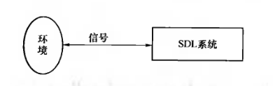

SDL描述系统行为的基础是扩展有限状态机. 系统行为由系统内所有进程实例对应的有限状态机协同工作以及与环境的信息交互来实现.

SDL中每个进程实例就是一个有限状态机,进程实例之间的通信用交换信号来实现,发送信号时可以明确地给出目标地址.

SDL系统与环境之间也能通信,SDL把环境视为一个进程,可以通过信号交互信息.

### SDL系统结构

进程实例是基本单位,系统行为主要用进程实例来描述


| 相同特性的进程实例  -->  进程集 | 功能相近的进程集 --> 功能块 |
| ------------------------------- | --------------------------- |
| 进程集之间利用信道传递信号      | 功能块之间利用信道传递信号  |

没有用信道连接,不能以信号的方式进行通信.

p.s.[post script]进程不能直接从环境得到信号,所以进程图边框不代表环境,只是该功能快的边界

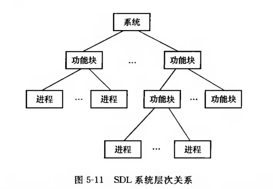

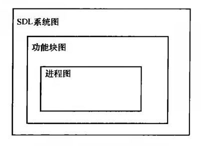


SDL语法规定,只有在信道上标注过的信号,才能在这条信道上传递

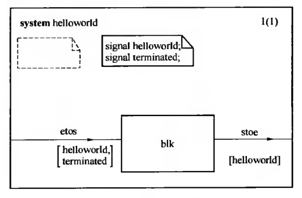

如图,信道etos上,只能传输helloworld和terminated两个信号


### SDL语法

##### 包 package

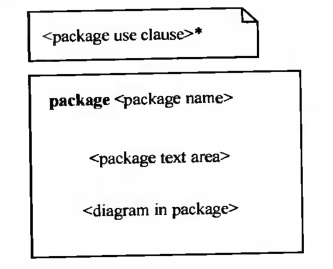

包类似于C语言中的.h文件

包含的内容可以被重用

##### 系统 system

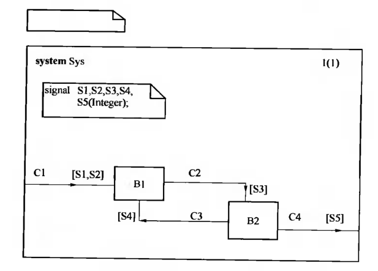

系统图右上角是图的页码编号,括号内是总页数

SDL系统图可以分成多页来画,头部说明( **system** Sys )必须相同


在定义中引用包

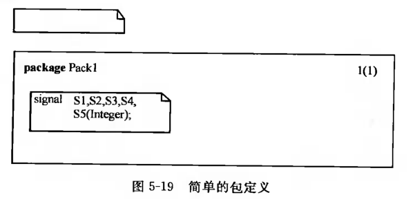

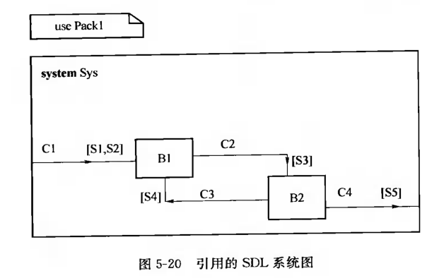

##### 功能块 block

一个系统可以划分成若干个功能块,

功能块又由若干进程和进程间的交互关系组成,

功能块可以划分为若干功能块.

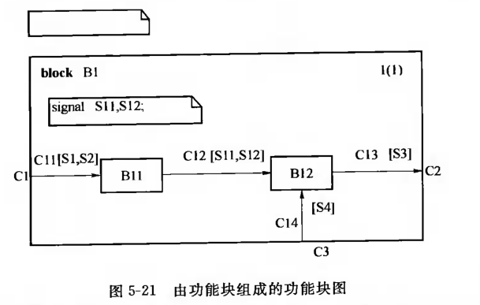

由于S11和S12只在本功能块内传递,对系统其他部分**不可见**,所以定义在块内


SDL系统中的功能块最终都要用进程来定义

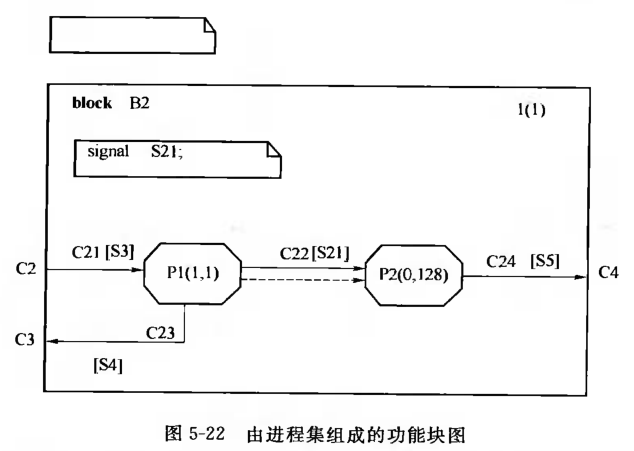

P1(1,1)表示系统初始化时创建一个P1实例,且运行期间最大实例数为1

P2(0,128)表示系统初始化时不会创建P2实例,最多存在128实例.

进程实例数缺省值为(0,inf)

虚线箭头 ---> 是创建进程意思

##### 进程 process

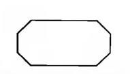

进程是系统的基本组成单位,系统的行为主要由进程来描述.

进程图的内容主要是状态机

进程的参数在创建进程实例时由创建者传给被创建实例,如下图所示 **";fpar"**

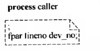

参数之间用 " , " 隔开,用 " ; " 结束

上图 参数类型是dev_no, 参数名是 lineno,声明方式和主流高级语言相反.


进程图是针对进程集的,进程集中的每个实例都执行进程图描述的动作.

每个进程实例都有一块私有存储空间,记录变量数值和自身状态

进程集中的实例是交替运行的,颗粒度为每个状态


进程实例一旦被创建,就有一个pid

pid获得方式:

- self:本进程pid
- sender:最近被消耗信号的进程实例pid
- parent:父进程pid
- offspring:子进程pid

##### 过程

过程是进程的一部分,过程不存在实例,可以被实例调用

调用过程就是执行一遍过程图的动作

过程引用: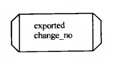

过程开始符号: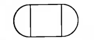

状态机可以没有终止符,但是过程图必须由返回符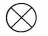返回值标在旁边.

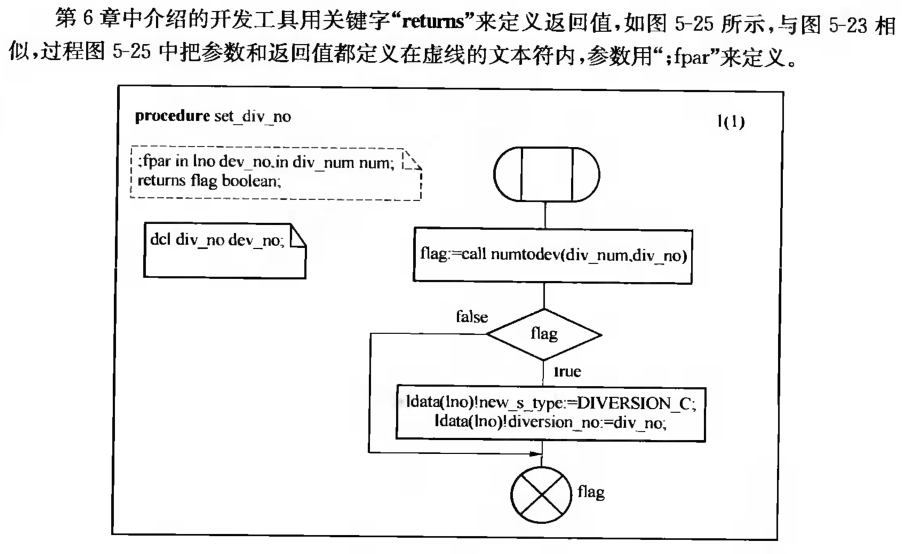

##### 远端过程

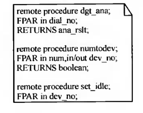

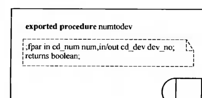

##### 信号与信道

**信号**是SDL系统中进程之间通信的主要形式.使用之前,必须:

1. 在系统图或功能块中定义信号(在文本符中用signal)
2. 在信道上给出信号列表,表明信号可以在那些信道中传递

信号可以带参数,定义是给出参数类型

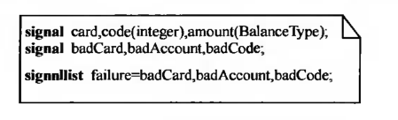

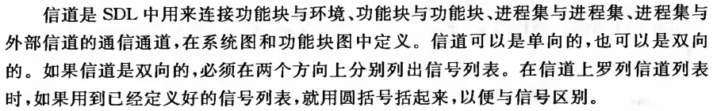

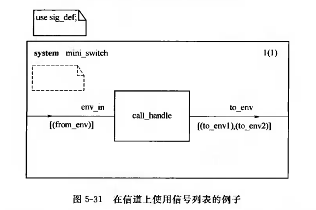

**延迟信道**:经过该信道的信号可能延迟

延迟信道方向箭头位于**信道中部**,一般用在系统图

非延迟信道在两端,一般用在在功能图

### 系统行为描述

##### 开始域

每个状态机都有且仅有一个开始域,开始域可以画在进程图的任意页上.

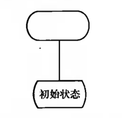

##### 状态域


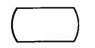

" * " 表示本状态机所有状态下引起的迁移是相同的

" *() "表示,除了括号内的状态,其他状态下迁移相同

状态不变时,状态符内的符号是"-"

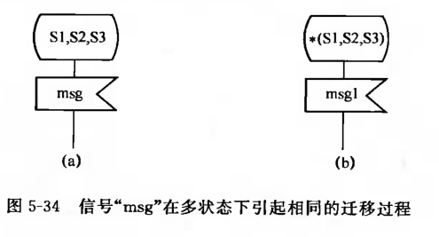

##### 触发事件

1. **输入**

   多个信号同一转移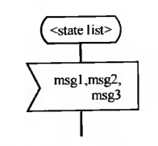

   除了指定信号,其他的 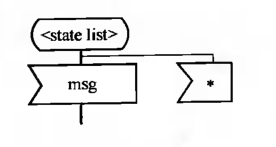

   状态机消耗一条信号后,用sender函数可以的得到发送该信号的进程实例pid;若来自环境,则sender函数返回的值不同于系统内的任何一个pid


   信号可以带参数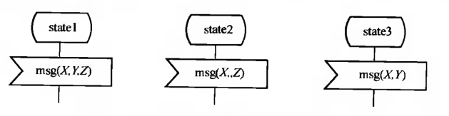

   输入符中还可以包含定时器名,表示收到定时器的超时信号(不能用sender)

   还可以包含远端过程名,表示利用远端过程调用来激活自己"procedure + name"

   如果需要处理异常输入,用自发输入(spontaneous input)来表示异常输入.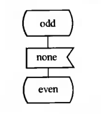

2. **优先输入**

   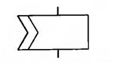

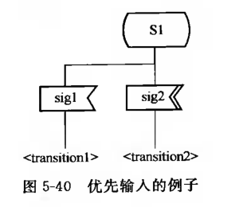

​	在sig1先到达本进程,如果消耗sig1之前sig2到达,先消耗sig2

3. **连续信号**

   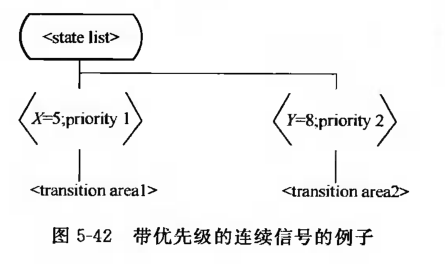

##### 保存域

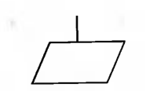

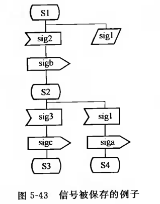

##### 输出域

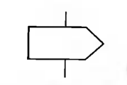

输出内容体由一个或多个信号名加目的地组成.

一个输出符可以输出多条信号,对带参数的信号,要在输出符中给出实际参数值

不需赋值的参数可以用逗号跳过

输出符中的目的地给出输出信号到达的地方:

- to \<pid expression> 直接给出接收该信号的进程实例pid
- to \<agent identifier> 直接给出接收该信号的进程标识符
- via \<channel identifier> 指明承载该信号的信道
- via \<gate identifier> 说明该信号经过哪个信关输出(用于进程类)
- to this 信号发送给本进程类

p.s.关键字via和to不能同时使用

##### 创建进程实例

分为 **静态创建** 和 **动态创建**

静态:系统初始化时创建的进程实例

动态:由活动的进程实例执行创建动作

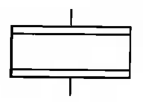

如果创建成功,offsping将返回被创建进程的pid

##### 任务域

任务 就是执行与变量有关的动作,如变量赋值,表达式计算

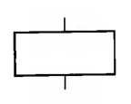

一个任务符中可以包含多条语句,用 " ; "隔开

1. 赋值语句

   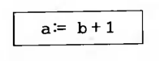

2. IF语句

   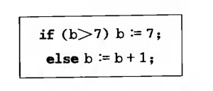

3. 分支语句

   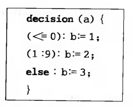

4. 组合上述三种语句

5. 设置语句,设置定时器

6. 复位语句,复位定时器

##### 过程调用

过程可以由状态

过程中可以发送信号

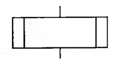

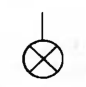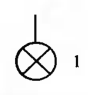

##### 分支域

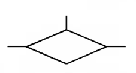

一个入口,多个出口

##### 连接域

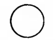

一页画不下,用连接符连接

##### 图形符号连接关系

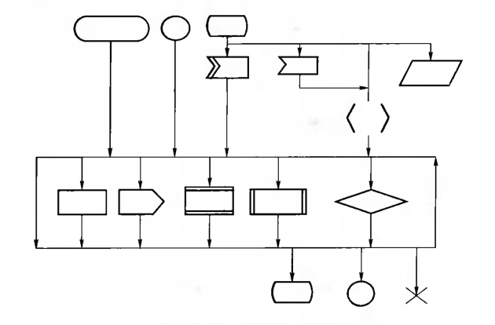

### 定时操作

设置定时器,启动定时器

复位定时器,停止指定定时器的计时


声明定时器

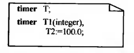

对于定时器T,设置操作时要给出定时时间间隔,S是一个Duration类型的同义词(常量),代表1s时间间隔

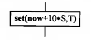

对于定时器T1,设置操作时要给出时间间隔和参数

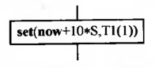

T1对应的复位操作也要给出定时器参数值

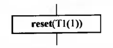

对于定时器T2,设置时不需要给出定时时间间隔

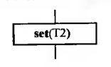

T2对应的复位操作


三个定时器超时可表示为


### 正文扩展与注释

正文扩展,图形符号放不下


注释


### 数据定义

##### 预定义数据类型

Boolean

Character

CharString:字符串型,字符串用单引号括起来 'abc',如果字符串中有单引号,则 'It''s' 表示 It's. ''表示空串. 多个连续空格=一个空格

Integer: -N - N-1

Natural: 0-N

Real: 实数

Pid: 进程标识符

Duration:时常类型,用于定时器设置定时,取值范围在语义上与实数型相同.

":=" 赋值操作

"=" 比较相等

"/=" 比较不相等

##### 定义新的数据类型

```SD
newtype '定义内容'
endnewtype;
```

1. 定义串类型

   ```SDL
   newtype 串类型名
   	string(串元素类型,空串标识)
   endnewtype;
   ```

   例子:定义一个由整数构成的串,空串用"Empty"表示

   ```SD
   newtype intstr
   	string(Integer,Empty)
   endnewtype;
   ```

2. 定义数组类型

   ```SDL
   newtype 数组类型名
   	array(数组索引类型,数组元素类型)
   endnewtype;
   ```

   例子:定义一个索引项为字符型,数组类型为整形的一维数组

   ```
   newtype int_array
     array(character,integer)
   endnewtype;
   ```

   例子:定义一个二维数组类型,索引项都是字符型,数组元素是自然数类型

   ```
   newtype nat_array1
     array(character,natural)
   endnewtype;
   
   newtype nat_array2
     array(character,nat_array1)
   endnewtype;
   ```

   nat_array2就是本例定义的二维数组

3. 定义结构类型

   ```
   newtype 结构类型名 struct
     字段1名 字段1类型;
     字段2名 字段2类型;
   endnewtype;
   ```

   例子:定义一个用来记录人员基本信息的结构类型

   ```
   newtype person_info struct
   	name charstring;
   	gender boolean;
   	age natural;
   	phone_number intstr;
   endnewtype;
   ```

4. 定义字面量类型

   ```
   newtype 字面量类型名
     literals 字面量名1,字面量名2,...,字面量名n
   endnewtype;
   ```

   例子:定义用于表示性别的字面量类型:

   ```
   newtype gender_type
     literals male,female
   endnewtype;
   ```

   

5. 定义选择类型

   ```
   newtype 选择类型名 choice
     字段1名 字段1类型;
     字段2名 字段2类型;
     ...
   endnewtype;
   ```

   和结构类型定义含义不同,结构类型变量每个字段有独立存储空间,互不影响.而选择类型的变量共享同一存储空间,空间大小以字段中占用空间最多的字段为准.

   某一时刻,只有一个字段是活跃的,该字段占用此空间.

   用另一个字段存储信息后,前一字段自动失效.

   选择类型定义的空间不能用来存储信息,只能作为临时存储空间


   例子:定义一个包含4个字段的选择类型:

   ```
   newtype C_type choice
     name charstring;
     gender gender_type;
     age natural;
     phone_number intstr;
   endnewtype;
   ```

   嵌入式环境下,存储空间比较紧张,也许会用到选择类型

6. 通过继承定义新的数据类型

   

##### 定义同义类型和同义词

1. **定义同义类型**

   用途:

   1. 为了限定某个数据类型的取值范围,但又不希望改变数据类型属性,以便满足特殊应用环境的需要.
   2. 给数据类型赋予一个有特定含义的名字,以便用户理解系统

	```
	syntype 同义类型名=原数据类型名[约束条件]
    endsyntype;
	```

	其中约束条件是可选项

  constants \<range condition> | \<size 	constraint>

	例子:定义一个取值范围被限定在0到127的整型同义类型:
	
	```
	syntype dev_no = Integer constants 0:127
	endsyntype;
	```
	
	例子:定义一个用来记录用户拨号号码的同义类型.0 - 9,*	(11),#(12)
	
	```
	syntype dial_no = Integer constans 0:9,11,12
	endsyntype;
	```
	
	例子:定义一个用来计费的数据类型,取值范围不限制
	
	```
	syntype billing_type = real
	endsyntype;
	```
	
	例子:定义一个由128个元素的pid型数组类型pid_array
	
	```
	syntype idx128 = integer constans 0:127
	endsyntype;
	newtype pid_array
	  array(idx128,PID)
	endnewtype;
	```

2. **定义同义词**

   ```
   synonym 同义词名 同义词数据类型 = 数值 或 external
   ```

   例子:定义几个同义词,用S_Idle代表整数0,S_Busy代表1,MaxNum代表最大数,其值由外部来确定

   ```
   synonym S_Idle Integer = 0;
   synonym S_Busy Integer = 1;
   synonym MaxNum Natual = external;
   ```

##### 变量定义与使用

- dcl 变量名 数据类型;
- dcl 变量名 数据类型 = 初值;
- dcl 变量名1,变量名2 数据类型;
- dcl 变量名1 数据类型1,变量名2 数据类型2;

1. **数组变量**

   - 变量声明

     ```
     dcl ch_nat nat_array,ch_var character,nat_var natural;
     ```

   - 初始化数组

     ```
     ch_nat := (. 0 .);
     ```

     符号" (. .) "表示对左边的变量所有元素赋同样的值

     符号" . "与赋值之间用工个隔开.

     不能用于结构型数组.

   - 访问数组元素

     ```
     ch_var := 'b'
     ch_nat('a')('b') := 10;
     nat_var := ch_nat('a')('b') + 1;
     ch_nat(ch_var)(ch_var) := nat_var;
     ```

2. **结构类型变量**

   - 变量声明

     ```
     dcl person_data person_info,pname charstring;
     ```

   - 访问结构字段

     ```
     person_data := (. 'peter',male,18,'1390000000'.);
     person_data!age := 20;
     p_name := person_data!name;
     ```

3. **选择型变量**

   - 变量声明

     ```
     dcl person_tmp C_type;
     ```

   - 访问字段

     ```
     person_tmp!name := person_data!name;
     ```

     

##### 远端变量

//todo

### 面向对象

//todo