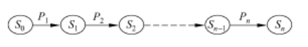

# 动态规划

###### dynamic programming

###### 动态         规划

动态规划法是将待求解问题分解成若干个子问题,但是子问题间往往不是相互独立的.动态规划法将每个子问题只求解一次并将其保存在一个表格中,当需要再次求解此子问题时,只是简单地通过查表获得该子问题的解,从而避免了大量的重复计算.

==动态规划法 算过的存起来,下次直接用==

原来的问题可以表示为

X = (x1,x2,x3,…xn) 

这样的话,解空间数则为指数形式

2n个

#### 最优性原理

对于有n个输入的最优化问题,可以看作一个自动机,每次动作使当前状态进行了转移

在多阶段决策过程中,由于每一阶段的决策仅与前一阶段的状态有关,而与如何到达这种状态的方式无关.

*最优决策是最后才产生的,在最后阶段向前推倒,一直到初始阶段,的到一个最优的决策序列.*

对一个状态可以可以进行多个决策,每一个决策可以产生一个新的状态,多阶段决策股满足**最优性原理:**

各子问题的解,只与它前面的子问题的解相关

而且各子问题的解都是相对于当前状态的最优解

整个问题的最优解是由各个子问题的最优解构成.

#### 动态规划法的设计思想

用一个表来记录所有已解决的子问题的解

#### 动态规划法设计算法

1. 分段:将原问题分解为若干个相互重叠的子问题
2. 分析:分析问题是否满足最优性原理,找出动态规划函数的递推式
3. 求解:利用递推式自底向上计算,实现动态规划过程

 

