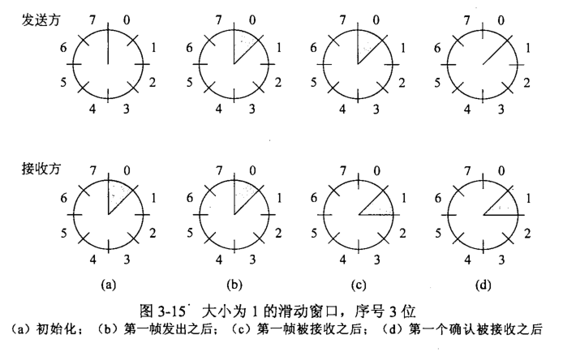
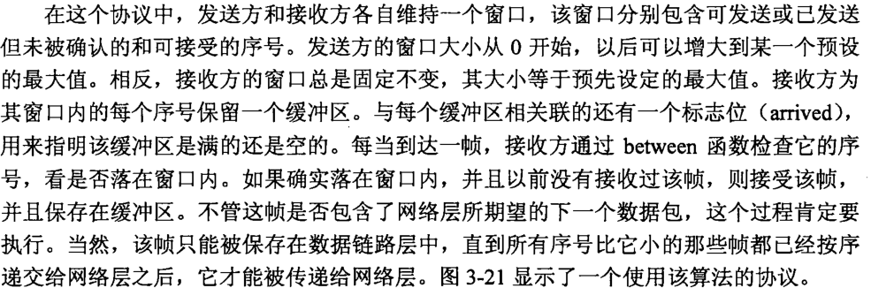

# 滑动窗口协议

运行两个实例,每一个实例使用一条独立的链路进行单工数据传输 ---浪费信道

更好的做法是 **使用同一条链路来传输两个方向上的数据**

进一步改进: 当到达一个数据帧时,接收方并不立即发送一个单独的控制帧,二十抑制自己并开始等待,直到网络层传递给它下一个要发送的数据包,然后确认信息被附加在往外发送的数据帧上(使用帧头的ack字段). 这种暂时延缓确认以便将确认信息搭载在下一个处境数据帧上的技术称为 **捎带确认(piggybacking*捎带*)**.

**捎带确认的优点:**

更好的利用了信道的可用带宽

帧头的ack字段只占用很少几位,而一个单独帧则需要帧头,确认信息,校验和

发送的帧越少,接收方的处理负担越轻

下面讨论的协议,捎带字段只占1位

**稍待确认带来的问题:**

下一次网络层传递包给数据链路层,要等多久?

如果等待时间超过了发送方的超时间隔,那么帧会被重传

**滑动窗口(sliding window):**

下面三个协议,任何一个出境帧都包含一个序号(0,max),max一般为2n - 1,这样序号刚好填入一个n位的字段中.

停等协议 n=1,序号只能为0,1

所有滑动窗口协议的本质是 **在任何时刻,发送方总是维持着一组序号,分别对应于允许它发送的帧,这些帧落在发送窗口(sending window),接收方也维持着一个接收窗口(receiving window),对应允许它接受的帧.**

发送方窗口和接收方窗口不必拥有相同的上下界和大小.

p.s.虽然协议给了顺序上的自由,但是<u>数据链路层协议将数据包递交给网络层的次序必须与发送机器上数据包从网络层被传递给数据链路层的次序相同</u>,同样物理通信信道也必须按照发送的顺序递交所有的帧.

由于帧可能丢失或损坏,发送方需要一个和窗口一样大的缓冲区来存放未被确认的帧

窗口满了就不接受来自网络层的包了

接收方也有一个缓冲区,收到一个帧,序号等于窗口下边界,就把它传给网络层,将窗口向前移动一个位置.

落在窗口外的帧会被丢弃

接受了帧,要会送一个确认信息

**网络层总是按照正确的顺序接受数据,跟链路层窗口的大小没有关系**

### 1位滑动窗口协议

###### 停等协议

### 选择重传协议

如果错误很少发生，则回退n协议可以供做得很好；

但是，如果线路质量很差，那么重传的帧要浪费大量带宽。

另一种错误处理的策略是 

##### **选择重传协议**：

允许对方接受并缓存坏帧或者丢失真后面的所有帧。

接收方为窗口的每个序号保留一个缓冲区,每个缓冲区有一个标志位,看缓冲区是空的还是满的

*缓冲区大小 = 窗口大小 = 计时器数*

发送方窗口:[0..max]

接收方窗口:[fixed..fixed] 固定不变. 

##### 非顺序接收引发的问题:

当接收方向前移动他的窗口后,新的有效序号的范围与老的序号范围有重叠.因此,后续的一批帧可能是重复的帧(如果所有的确认都丢失了),也可能使新的帧(如果所有的确认都接受到了). **但是接收方无法区分这两种情形**

##### 解决方法:

窗口的最大尺寸应该不超过序号空间的一半

RWS = (MAX_SEQ+1)/2

来确保接收方向前移动窗口之后,新窗口与老窗口的序号没有重叠.

